[![IBM Cloud powered][img-ibmcloud-powered]][url-ibmcloud]

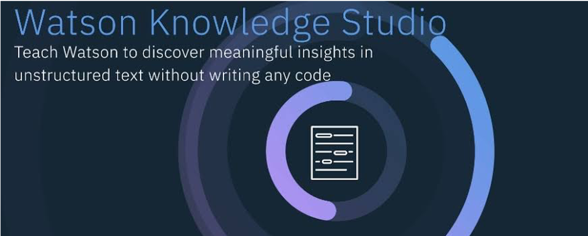


# Watson Knowledge Studio

Enseñe a **IBM Watson** el lenguaje con modelos personalizados que identifican entidades y relaciones exclusivas de su industria en texto no estructurado. Construya modelos en un entorno de colaboración diseñado para desarrolladores y expertos, sin necesidad de escribir código.

[![IBM Cloud Watson Discovery][img-ks]][url-ks]
[![Demo Discovery][img-demoks]][url-demoks] 

## Antes de empezar te recomendamos:
* Si eres estudiante o profesor y tienes correo institucional te recomendamos los [Cupones][url-cupones].
* Si tienes algun codigo promocional te decimos como [Aplicarlos][url-aplica].

[url-cupones]: https://github.com/ibmdevelopermx/Watson-Serie#Cupones-para-profesores-y-estudiantes
[url-aplica]: https://github.com/ibmdevelopermx/Watson-Serie#Cargar-cr%C3%A9ditos-en-IBM-Cloud


# Índice
* [PreWork](#PreWork).
* [Crear una instancia de Natural Language Understanding](#Crear-una-instancia-de-Natural-Language-Understanding).
* [Crear una instancia de Knowledge Studio](#Crear-una-instancia-de-Knowledge-Studio).
* [Crear el type system](#Crear-el-type-system).
* [Crear el corpus](#Crear-el-corpus)
* [Crear annotation task](#Crear-annotation-task)
* [Anotación del set de documentos](#Anotación-del-set-de-documentos).
* [Entrenar el modelo](#Entrenar-el-modelo)
* [Desplegar el modelo en Natural Language Understanding](#Desplegar-el-modelo-en-Natural-Language-Understanding)
* [Implementar el modelo en una Java app](#Implementar-el-modelo-en-una-Java-app)
* [Subir la app a la nube](#Subir-la-app-a-la-nube)

## PreWork
* Cuenta de [IBM Cloud][url-IBMCLOUD]
* Instalar [CLI de IBM Cloud][url-CLI-IBMCLOUD]
* Cuenta en [GitHub][url-github-join]
* Instalar [CLI de GitHub][url-github-cli] o instalar [GitHub Desktop][url-githubdesktop]
* Instalar Java [java][url-java]
* Instalar Maven
    - [Windows][url-mavenw]
    - [Mac OS][url-mavenmac]
* "Fork" y clona el repositorio : [Knowledge Studio][url-git].

## Crear una instancia de Natural Language Understanding.
1. En la plataforma de IBM Cloud dirígete a la sección de catálogo, y en la caja de búsqueda el nombre del servicio **Natural Language Understanding** y da click.
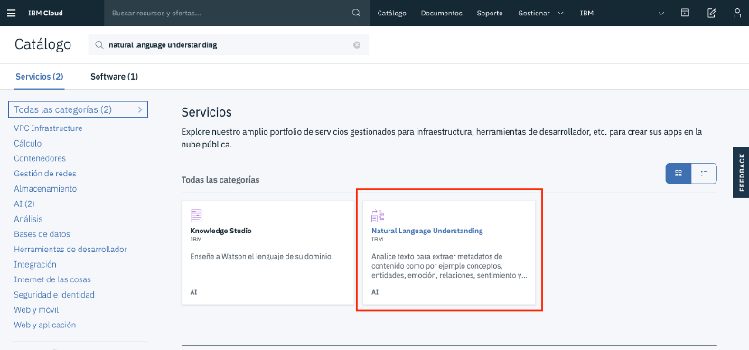
2. Selecciona un nombre y da click en el botón de “crear” para obtener una instancia del servicio.
3. En la barra que se encuentra a la izquiera navega a “gestionar” y copia el valor de la “clave de API” o “apikey” en un lugar ya que lo ocuparemos después.
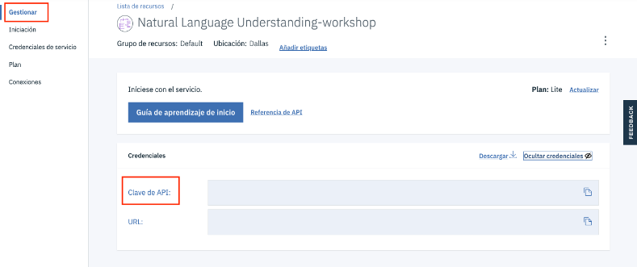

## Crear una instancia de Knowledge Studio.
1. Igual que en la creación de la instancia del otro servicio, dirígete a la sección de catálogo y teclea el nombre del servicio “knowledge Studio”, da click, ponle un nombre y click al botón crear.
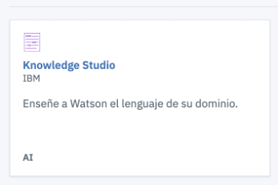
2. Ahora dirígete a “gestionar” y click al botón que Inicia la herramienta de Knowledge Studio.


## Crear el type system.
1. Adentro de la herramienta crearemos un "workspace" de entidades y relaciones. Le damos click y le damos un nombre para el "workspace". Elegimos el idioma en el que estará la información de la cuál queremos extraer datos, que en este workshop serán en "español".
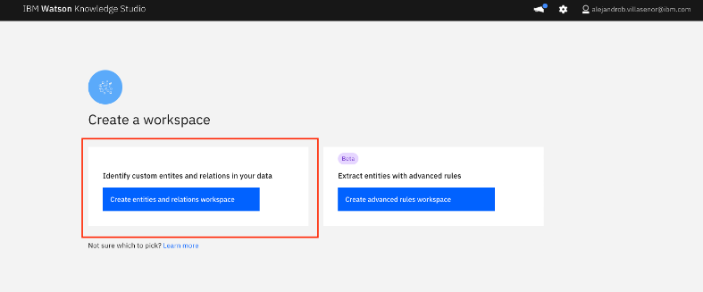
2. Ahora crearemos el “type system” el cuál son el conjunto de las entidades que queremos extraer de los documentos que nos interesa sacarles datos.
    - Para fines prácticos de este workshop tenemos un “type system” en formato .json listo para cargarse en la herramienta. Este archivo .json se encuentra dentro del file que descargaste de nuestro repositorio en GitHub. (data/”types…”.json)
	- Haz click en “upload”.
    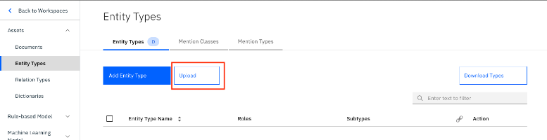
    - Carga el archivo en formato .json.<br>
    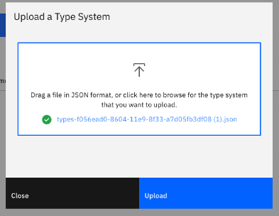<br>
Y ya tienes creado el “type system” con las entidades que deseas extraer de información no estructurada.
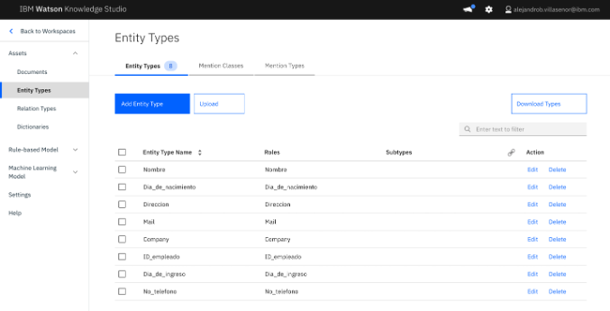

## Crear el corpus.
1. Ahora crearemos el “corpus” que son los documentos que usaremos para entrenar nuestro modelo, en el cuál identificaremos manualmente las entidades de nuestro “type system”.
    - Para fines prácticos de éste workshop tenemos un “corpus” de documentos de ejemplo para nuestro entrenamiento y ya preparados para entrenarse con algoritmos de inteligencia artificial. El archivo se encuentra en (data/corpus…zip).
2. Seleccionamos “upload documents sets”.
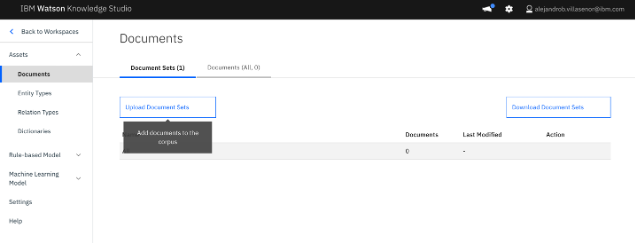
3.  Cargamos el documento.<br>
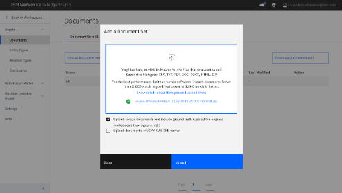
4.  Se creó un “document set” el cuál tiene 10 archivos .txt que se usarán para el entrenamiento.<br> El “document set” se dividió entre training, test, blind porque para motivos del workshop el “corpus” ya tiene precargado el “ground truth” ya que los documentos vienen pre anotados. 
    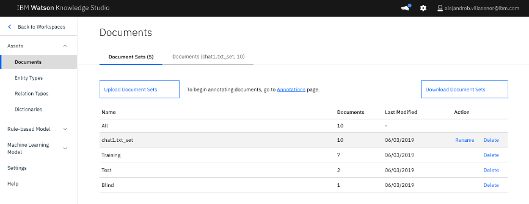


## Crear annotation task
Para tener organizadas nuestras anotaciones debemos crear un “task”.
1. Ve a la sección de “annotations”, pestaña “annotations tasks” y dale click a “add task”.
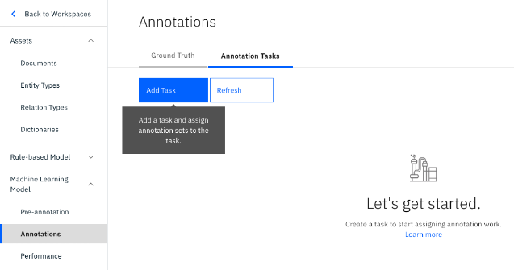
2. Le damos un nombre y nos dirigimos a "Crear un se de anotaciones".
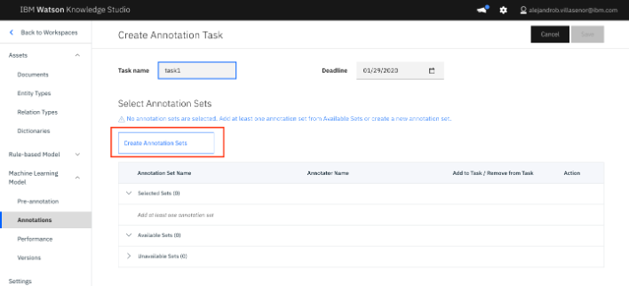
3. Te saldrá que lo nombres, déjalo con los valores por default y elige un anotador que en este caso será tu usuario.
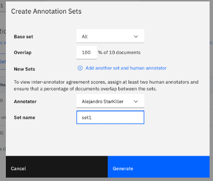
4. Ya que has creado tu “task” con un set de anotaciones dentro, has click en tu task que acabas de crear.
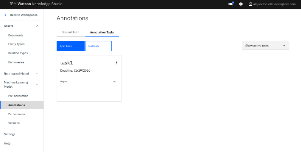

## Anotación del set de documentos
1. Has click en “annotate”.<br>
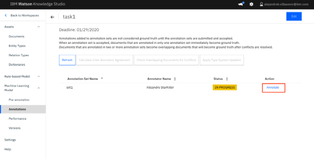
2. Veras todos los documentos que formas el set de anotación.
    - Dale click a alguno.<br>

3. Notarás que ya vienen las anotaciones de las entidades echas en nuestros documentos, y **esto es para fines prácticos del workshop**. Debes saber que estas anotaciones se deben hacer por un humano en cada uno de los documentos que formen nuestro “corpus”.
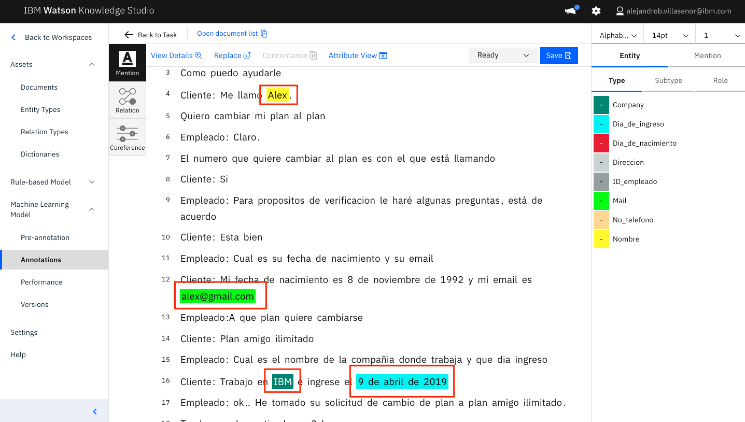
4. Regresa a la vista donde vemos todos los documentos.
5. Selecciona “submit all documents” lo que quiere decir que las anotaciones ya están listas.
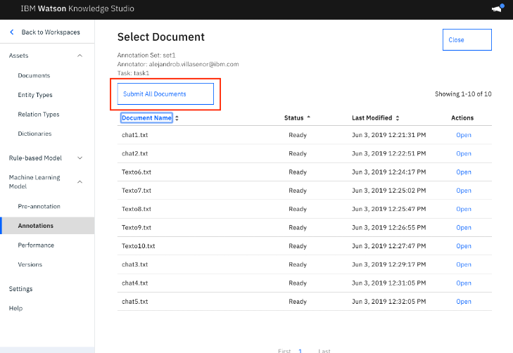
6. Selecciona el set recién anotado y da click en "aceptar".
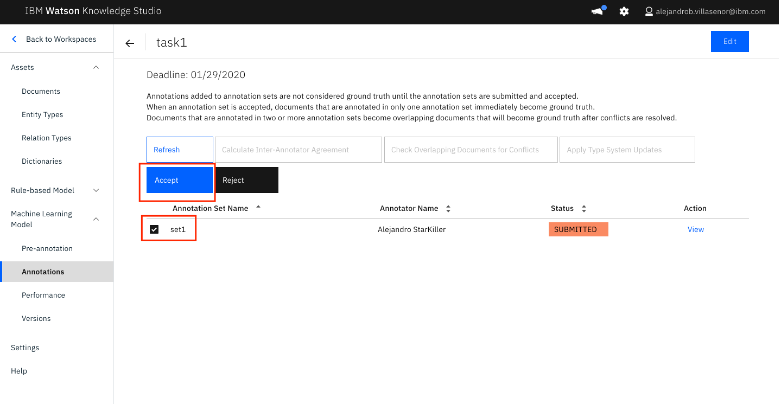

## Entrenar el modelo
1. Dirigete a la sección de “performance” y da click en “train and evaluate”.
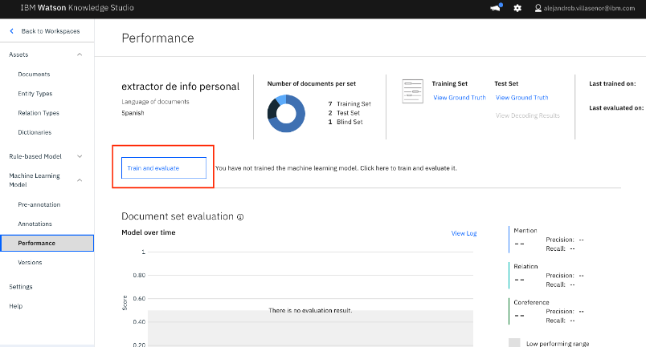
2. Selecciona el set y dale click a “train”.

3. Envíaste tu “corpus” con las anotaciones a algoritmos de inteligencia artificial para obtener un modelo personalizado para entender lenguaje natural. El entrenamiento tarda aproximadamente 10 minutos.

## Desplegar el modelo en Natural Language Understanding.
1. Dirigete a la sección “versions”.
2. Has click en “create version".
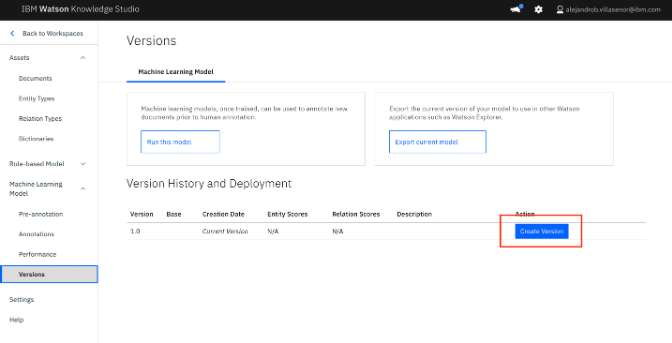
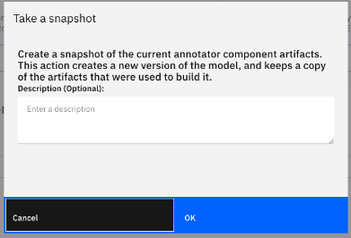
3. Damos click en "Deploy".
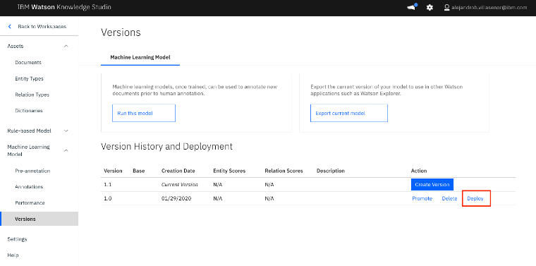
4. Elije el servicio **Natural Language Understanding** para desplegar el modelo que acabas de crear.
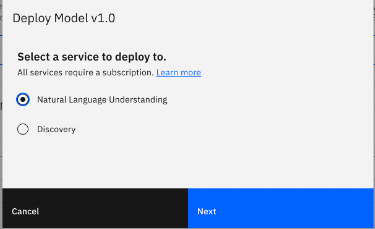
5. Busca el servicio que creamos en pasos anteriores del workshop.
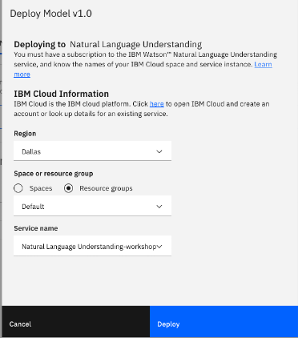
6. Has desplegado tu modelo personalizado con **Knowledge Studio** al servicio de **Natural Language Understanding**. Ahora serás capaz de obtener la información que quieres de cualquier texto.
7. Copia el “Model ID” en un lugar.<br>
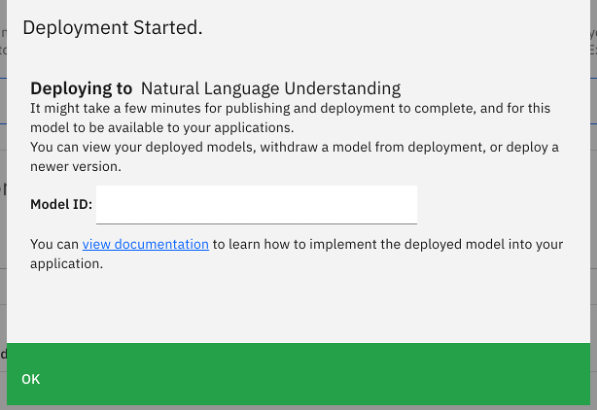


## Implementar el modelo en una Java app
1. Ahora te proporcionamos una app desarrollada en Java para que puedas probar tu modelo de una manera muy intuitiva y visual. Siéntete libre de explorar la app para que veas como funcionan las llamadas a la **API** de **Natural Language Understanding**. 
2. En la carpeta del proyecto dirígete a "src/main/resources/config.properties". Ahí debes poner las credenciales de los servicios que creaste en los primeros pasos.
    - *nota: el username siempre será “apikey”*.
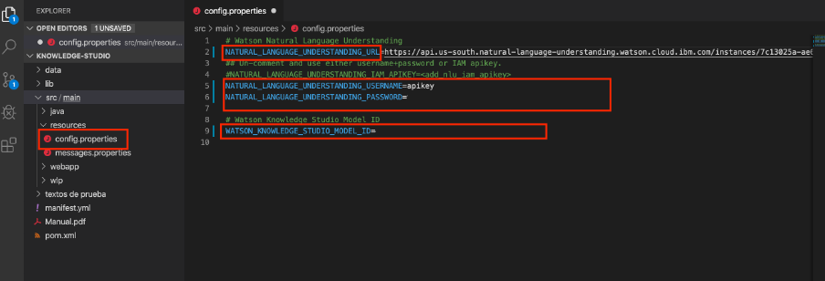
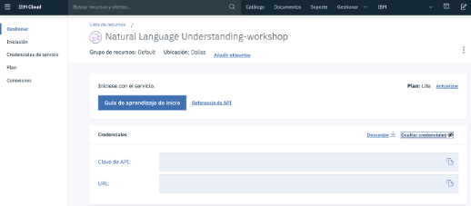
3. Ahora dirígete al archivo "manifest.yml" que es el archivo con el que se hará el despliegue a la nube. Ponle un nombre único en la sección de “name”.<br>
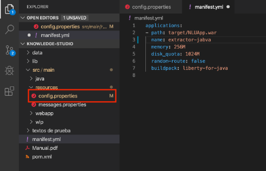

## Subir la app a la nube                        
1. Abre la terminal y escribe lo siguiente para loguearte a IBM Cloud desde la terminal.
``` bash
      ibmcloud login –sso
```

2. Logueate en la region sur (si te lo solicita).
3. Escribe lo siguiente comando para apuntar a una organización y un espacio.
``` bash
      ibmcloud target –cf
```

4. Apunta a un resource group con el siguiente comando.
``` bash
    ibmcloud target -g Default
```

5. Posicionate en la carpeta del proyecto y escribe lo siguiente para hacer el "build" de la app.
```bash
    mvn clean package
```

6. Ahora con el siguiente comando haras el "deploy" a la nube.
``` bash
    ibmcloud cf push
```

7. Entra a la url que te arroja al final, y tendras desplegada la app y lista para usar.

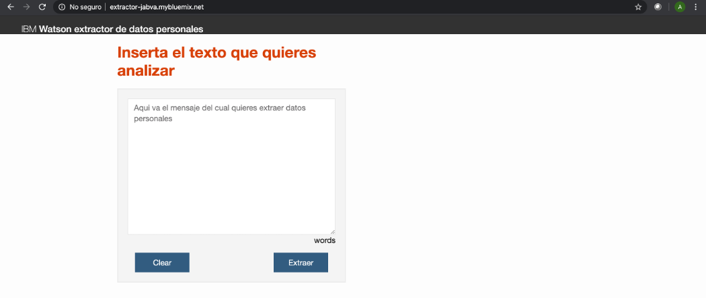


[url-IBMCLOUD]: https://cloud.ibm.com/registration
[url-CLI-IBMCLOUD]: https://cloud.ibm.com/docs/cli/reference/ibmcloud?topic=cloud-cli-install-ibmcloud-cli
[url-java]: https://www.java.com/es/
[url-mavenw]: https://howtodoinjava.com/maven/how-to-install-maven-on-windows/
[url-mavenmac]: http://www.codebind.com/mac-osx/install-maven-mac-os/
[url-github-join]: https://github.com/join
[url-github-cli]: https://git-scm.com/book/en/v2/Getting-Started-Installing-Git
[url-githubdesktop]: https://desktop.github.com/
[url-git]: https://github.com/ibmdevelopermx/Knowledge-studio

[img-ibmcloud-powered]: https://img.shields.io/badge/IBM%20Cloud-Powered-blue.svg
[url-ibmcloud]: https://www.ibm.com/cloud/
[img-ks]: https://img.shields.io/badge/IBM%20Cloud-Watson%20Knowledge%20Studio-blue.svg
[url-ks]: https://www.ibm.com/cloud/watson-knowledge-studio
[img-demoks]: https://img.shields.io/badge/IBM%20Cloud-Watson%20Knowledge%20Studio-red.svg
[url-demoks]: https://dte-watson-knowledge-studio-demo.mybluemix.net/self-service/home