[![IBM Cloud powered][img-ibmcloud-powered]][url-ibmcloud]

# Pre-requisitos
* Tener instalado [**Node.js**](https://nodejs.org/es/). 
* Tener una cuenta de [**IBM Cloud**](https://ibm.biz/BdfYZt). 
* Instalar [CLI de IBM Cloud][url-CLI-IBMCLOUD] 
* Tener una cuenta en [**Github**](https://github.com). 
* **Clonar este Repositorio**.  

## Cupones para profesores y estudiantes:

* Acceder al portal de [IBM Academic Initiative][url-academic] y seleccionar la opción "Register now" si aun no tienes cuenta.
* Realizar el registro correspondiente utilizando la cuenta de correo académica y confirma tu cuenta.
* Despues de confirmar tu cuenta, y con la sesion iniciada en IBM Academic Initiative, en la parte de "Most Popular Topics covered", encontraremos **IBM Cloud** y damos clic en "Learn more".
* Bajamos de la pagina hasta encontrar "Software". Le damos clic, nos dara un apartado que se llama "Request Feature Code".
* Nos dara nuestro codigo. Lo copiamos y lo llevamos a **IBM Cloud**.

## Cargar créditos en IBM Cloud:

* En la parte superior derecha, buscaremos la parte de "MANAGE"/"GESTIONAR", nos desplegara una lista y seleccionaremos "Account"/"Cuenta".
* De lado izquierdo, tendremos una opción "Account settings"/"Configuracion de cuenta".
* Bajamos un poco hasta encontrar "Subscription and feature codes"/"Codigos de suscripción y carateristicas".
* Da clic en "Apply code"/"Aplicar codigo".
* Ingresamos el codigo y clic en "Apply"/"Aplicar".

[url-academic]: https://my15.digitalexperience.ibm.com/b73a5759-c6a6-4033-ab6b-d9d4f9a6d65b/dxsites/151914d1-03d2-48fe-97d9-d21166848e65/home/
[url-onthehub]: https://onthehub.com/ibm/?utm_sourc=ibm-ai-productpage&utm_medium=onthehubproductpage&utm_campaign=IBM
[url-IBMCLOUD]: https://cloud.ibm.com/registration
[url-CLI-IBMCLOUD]: https://cloud.ibm.com/docs/cli/reference/ibmcloud?topic=cloud-cli-install-ibmcloud-cli
[url-github-join]: https://github.com/join
[url-github-cli]: https://git-scm.com/book/en/v2/Getting-Started-Installing-Git
[url-githubdesktop]: https://desktop.github.com/
[url-node]: https://nodejs.org/es/download/

# Watson Discovery
Facilita la construcción de aplicaciones de exploración cognitivas y basadas en la nube que desbloquean las percepciones accionables que hay ocultos en los datos no estructurados, permitiendo extraer el sentimiento, las entidades, los conceptos, los roles semánticos, etc..

[![IBM Cloud Watson Discovery][img-discovery]][url-discovery]  

El principal beneficio de usar **Watson Discovery** es el poderoso motor de analisis que provee enriquecimientos cognitivos y caracteristicas a tu información. Esto provee ejemplos de como mostrar estos enriquecimientos mediante el uso de filtros, listas y graficas. Los principales enriquecimientos en los que nos enfocaremos son:

* Entidades- personas, compañias, organizaciones, ciudades, y más.
* Categorias - Clasificación de información en jerarquia de categorias hasta de 5 niveles de profundidad.
* Conceptos - Identificar conceptos generlaes que no estan necesariamente referenciados en la información.
* Palabras clave - Temas importantes usados de forma tipica para buscar o encontrar información.
* Sentimientos - El sentimiento total positivo o negativo de cada documento.

## Contenido
* [Creación de una instancia de Discovery](#Crear-una-instancia-de-Discovery)
* [Realizar el scrapping de los datos](#Preparar-datos-y-documentos)
* [Realizar una consulta a la base de datos](#Realizar-una-consulta-a-la-base-de-datos) 
* [Crear una consulta](#Crear-una-consulta)
* [Realizar una consulta](#Realizar-una-consulta)
* [Desplegar una app que consuma el servicio](#Despliegue)

# Crear una instancia de Discovery
1. En la parte superior derecha, damos clic en catalog o catálogo.
2. En el menú del lado izquierdo, selecciona la opción de AI y posteriormente, el servicio de Discovery.
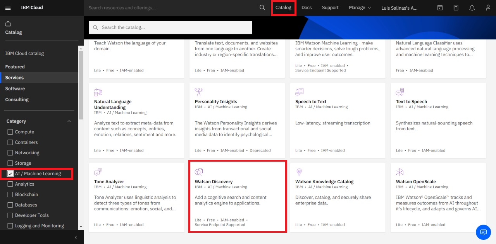
3. Le damos nombre al servicio, seleccionamos el plan de pago que querramos y damos clic en Create o Crear.
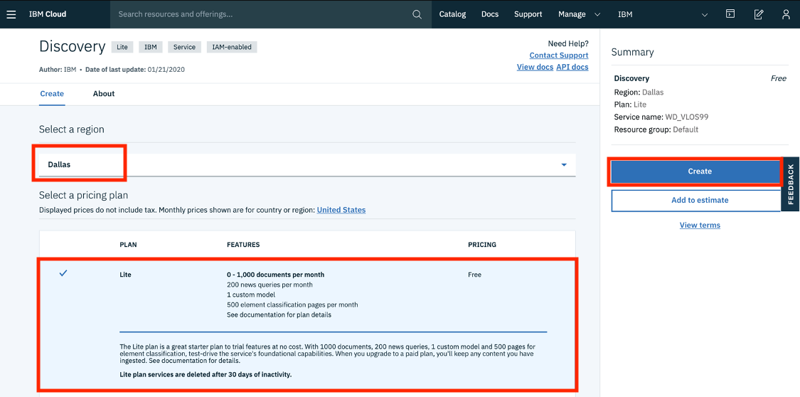
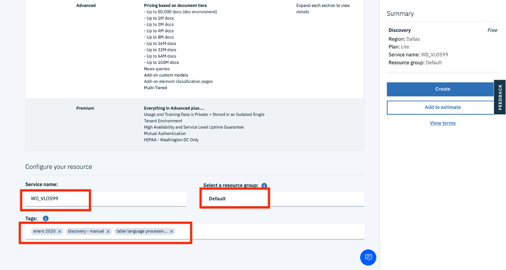
4. Una vez que nos encontramos en nuestro Dashboard o Panel de control, seleccionamos el servicio que acabamos de crear desde la pestaña de Servicios o Services.
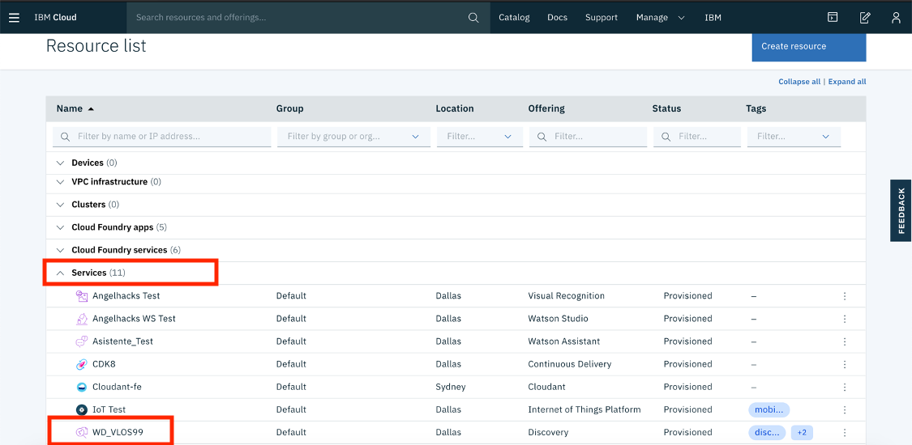
5. Una vez dentro de la página del servicio, damos clic en Launch Watson Discovery o Iniciar Watson Discovery.
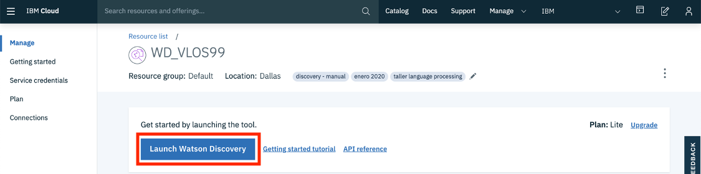
6. Ahora crearemos una nueva colección dando clic en “Cargar tus propios datos” o “Upload your own data”.
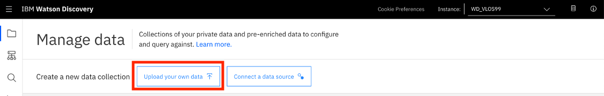
7. Damos clic en “Configurar con el plan actual” o “Set up with current plan” y posteriormente en Continue o Continuar.
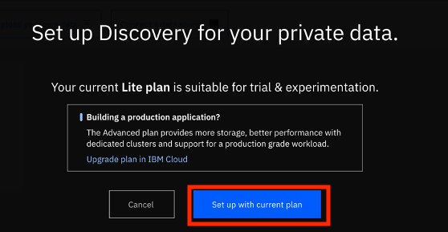

8. Le damos un nuevo nombre a nuestro servicio, seleccionamos el idioma español y damos clic en crear.
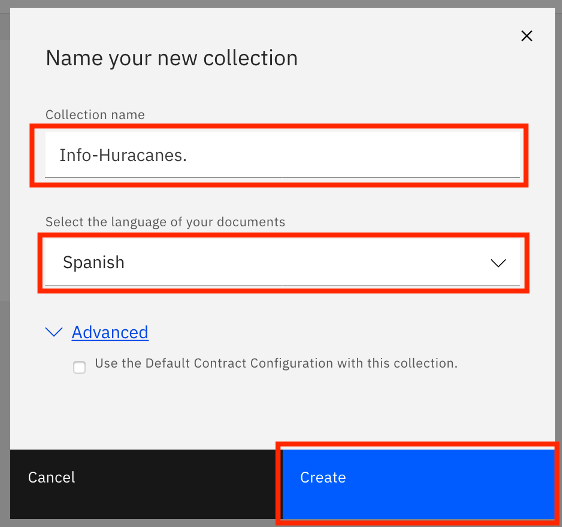

## Preparar datos y documentos. 
1. Ingresa a la carpeta L2 del repositorio clonado. (Discovery Docs/L2).
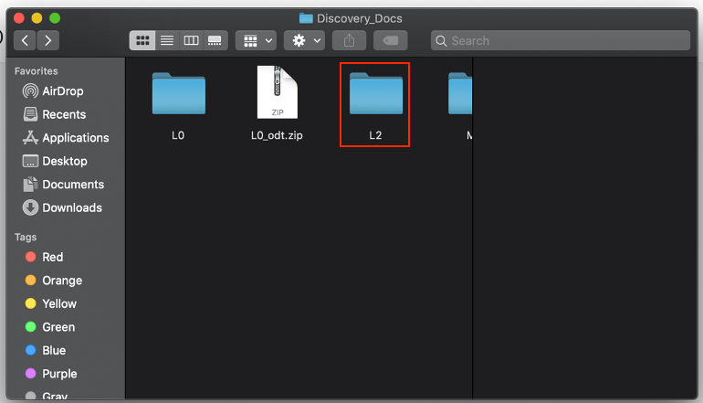
2. Regresa al servicio de Discovery y arrastra y suelta los documentos de la carpeta antes mencionada a la parte que dice “Upload data to get started” o da clic en “Select documents” o “Seleccionar documentos”.
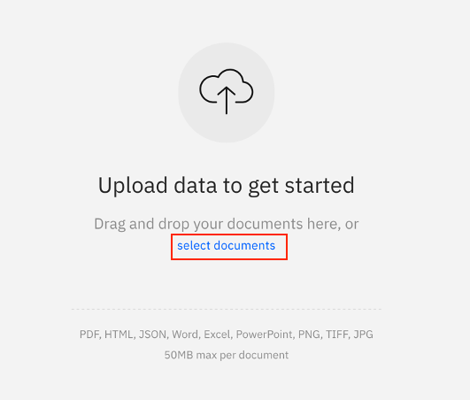
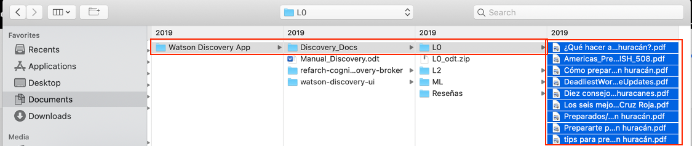

3. Una vez hecho esto, espera a que los datos sean procesados.
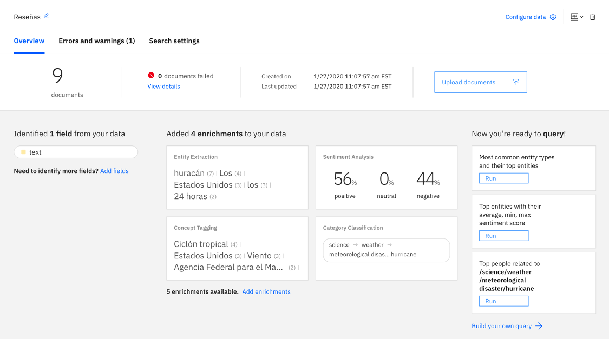

## Realizar una consulta a la base de datos. 
1. Realizar una consulta simple.
  1. Da clic en “Build your own query” o “Crea tu propia consulta”.
  
  2. Da clic en “More Options” o “Más opciones” para desplegar los demás campos.
  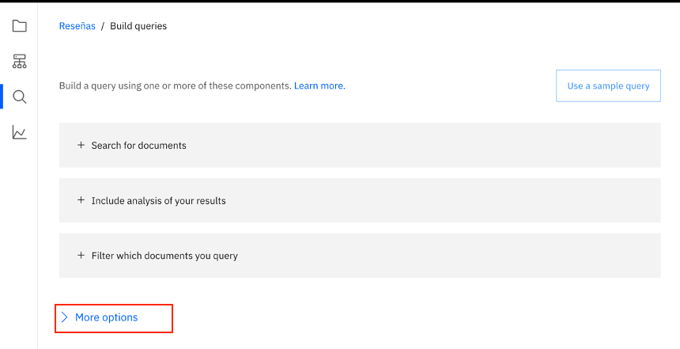
  3. En Passages o Pasajes, seleccionamos la opción no en el apartado “Include relevant passages” o “Incluir pasajes relevantes”.
  4. Da clic en “Run query” o “Realizar consulta”.
  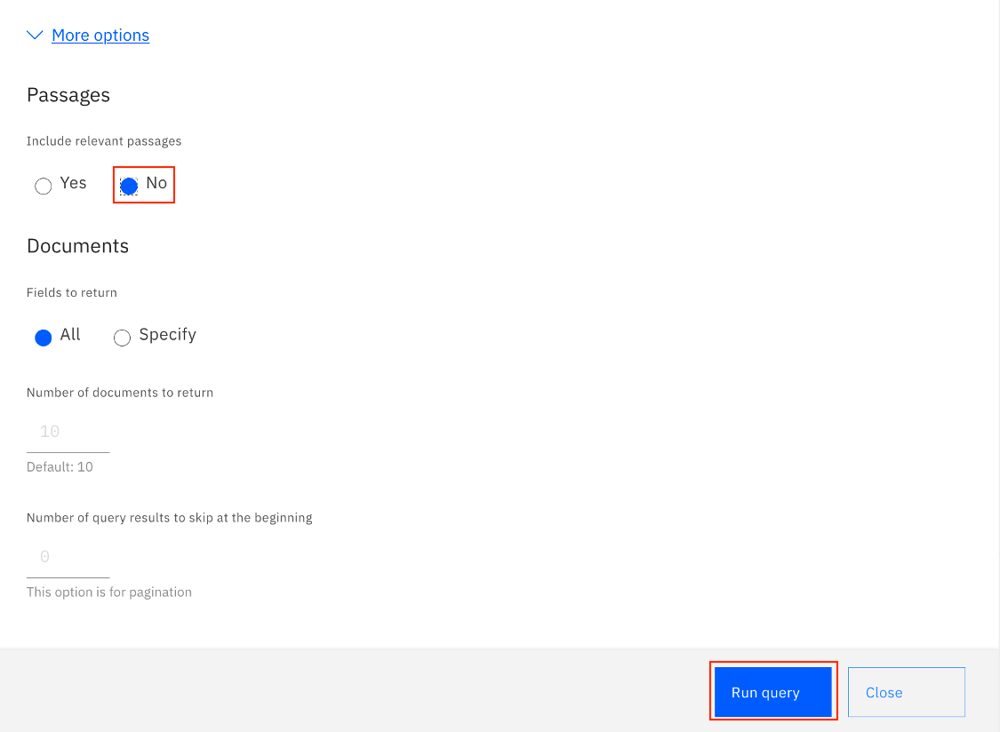

De esta forma, lograrás ver en el documento JSON que se genera de la consulta, los diferentes campos, como entidades (entities), conceptos (concepts) y sentimientos (sentiment) de la colección de datos que se consultó.

## Crear una consulta.
Este paso puedes realizarlo en un editor de textos. 
Primero necesitamos escribir: "enriched_text." <!-- seguido de un punto. --> 
Después escribimos el nombre del objeto que deseemos buscar.(entities, concepts, sentiment, keywords). En este caso, buscaremos en "entities:" <!-- Seguido de dos puntos. --> 
Ahora escribimos el nombre del valor que se busca, entre paréntesis (text, label, type). En este caso, utilizaremos "text:" <!-- seguido de dos puntos. --> 
Finalmente, después de los dos puntos, escibimos el valor que deseamos buscar. Para esta ocasión, utilizaremos "tormenta" y cerramos paréntesis. 
La constulta entonces debería quedar así: 
**enriched_text.entities:(text:tormenta)**

## Realizar una consulta.
Ahora vamos a probar la consulta que acabamos de crear.
1. Primero debemos crear una nueva consulta con “Build your own query” o “Construye tu propia
consulta”. Desplegamos el apartado “Search for documents” o “Buscar documentos”. Damos clic en la pestaña “Use the Discovery Query language” o “Usar el lenguaje de consultas de Discovery”. Podemos crear la consulta directamente como se muestra en la imagen o hacerlo de forma manual con el lenguaje de consultas de Discovery.
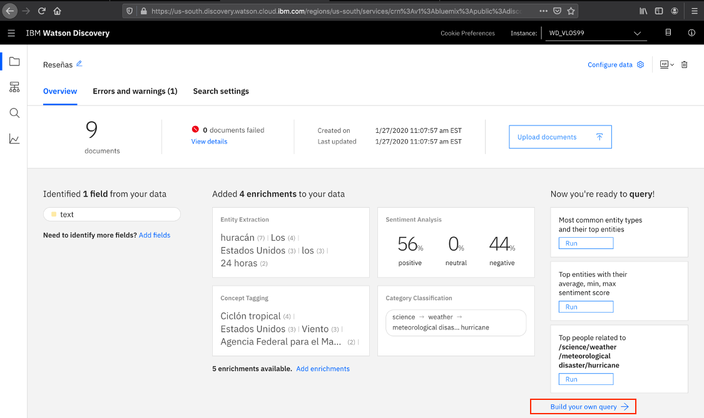
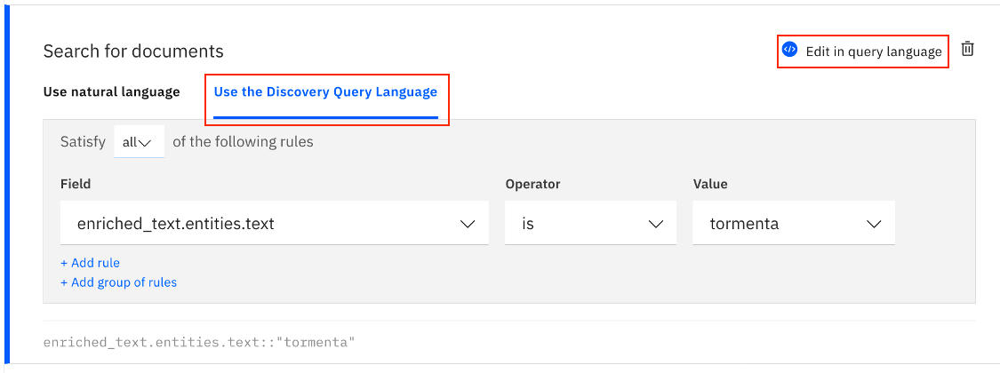
2. Para realizar la consulta manual (como la armamos en el paso [anterior](#Crear-una-consulta)), damos clic en “Edit in Query Language” o “Editar en lenguaje de consultas”.
3. En la caja de texto que dice “Enter query here” o “Ingresa consulta aquí”, escribimos o pegamos la consulta que creamos en el paso anterior y damos clic en “Run query” o “Generar consulta”.
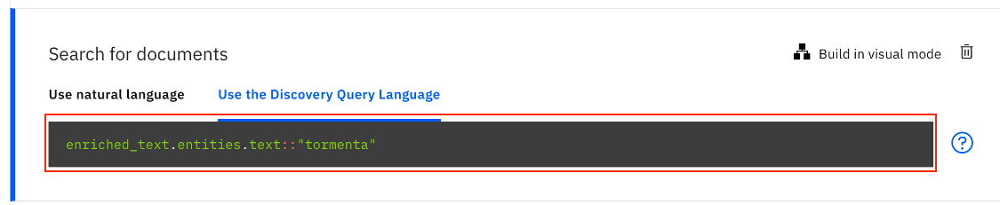
4. Al realizar la consulta, nos dará como retorno la serie de documentos que cumplan con los parámetros de la consulta.
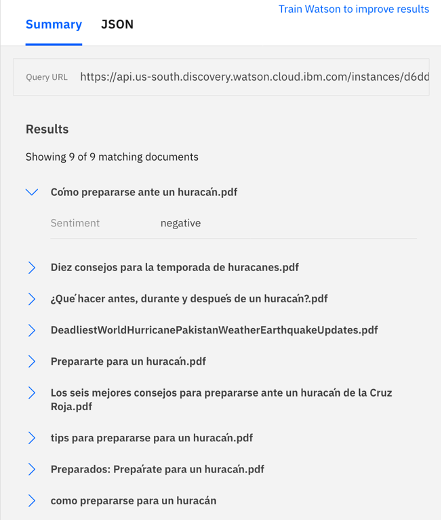
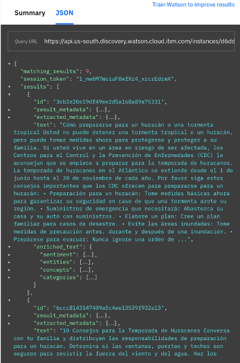

## Desplegar una app que consuma el servicio de Watson Discovery.
1. Ingresamos a la página principal de nuestro servicio de discovery y damos clic en “Upload your own data” o “Cargar tus propios datos”, para crear una nueva colección.
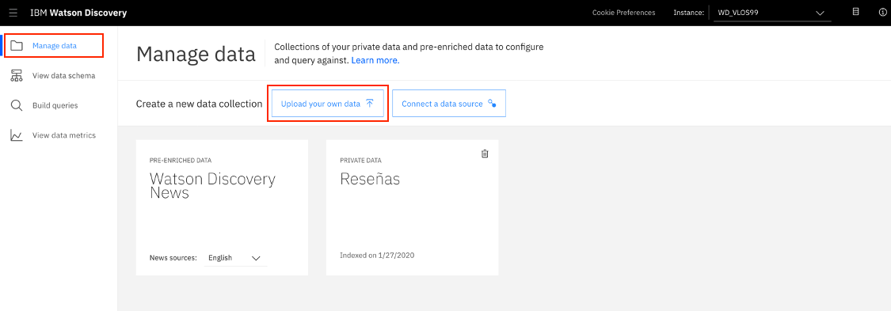
2. Le damos el nombre de “Reseñas”, seleccionamos el idioma “Español” y damos clic en “Create” o “Crear”.
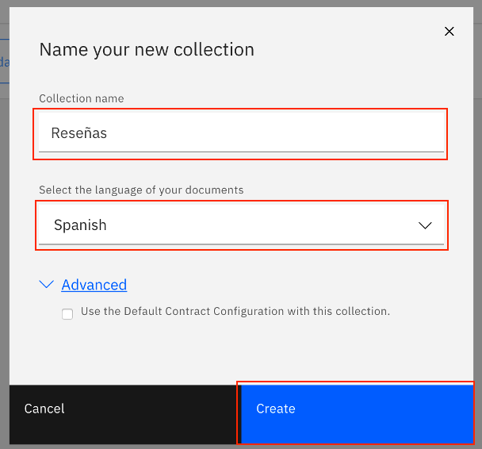
3. Vamos a configurar la colección. En la parte superior derecha, damos clic en “Configure Data” o “Configurar documentos”.
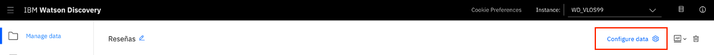
4. Vamos a la pestaña de “Enrich Fields” o “Enriquecer campos” y debajo de “Enrichments” damos clic en “Add Enrichments”.
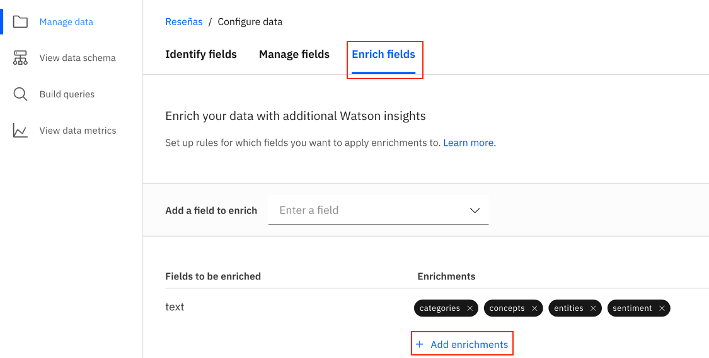
5. Agregamos el campo “Keyword extraction” o “Extracción de palabras clave” dando clic en “Add” o “Agregar”.
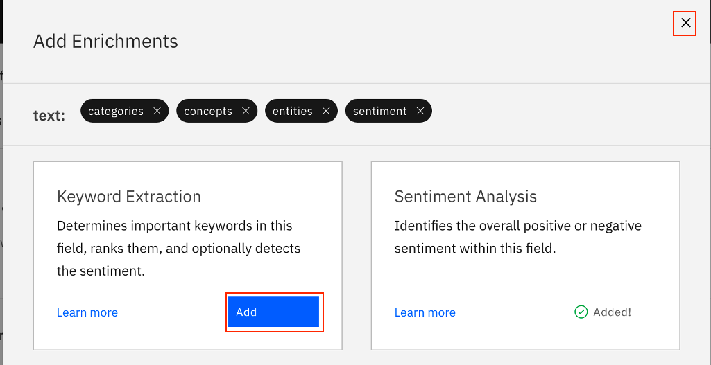
6. Cerramos el apartado para agregar enriquecimientos y damos clic en “Apply changes to the collection” o “Aplicar cambios a la colección”.
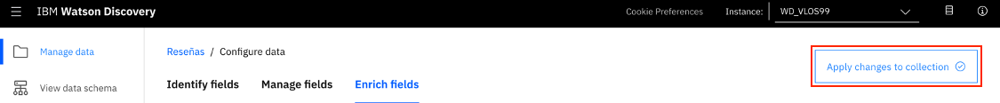
7. Ahora cargamos los documentos necesarios a nuestra colección.
De la carpeta Seleccionamos todos los archivos que se encuentran en la carpeta de nuestro repositorio(watson-discovery-master/Discovery_docs/Reseñas), de la misma forma que hicimos en el paso [para preparar los datos](#Preparar-datos-y-documentos).
Una vez que hemos cargado los documentos, procederemos a modificar el archivo .env que se encuentra en la carpeta de nuestro repositorio, agregando las credenciales correspondientes a nuestra colección.
8. En el apartado superior derecho de la página principal de nuestra colección, encontraremos un ícono que dice “API”, al poner el mouse sobre el, nos muestra un mensaje que dice “View API details” o “Ver detalles de API”. Le damos clic para copiar cada una de las credenciales.
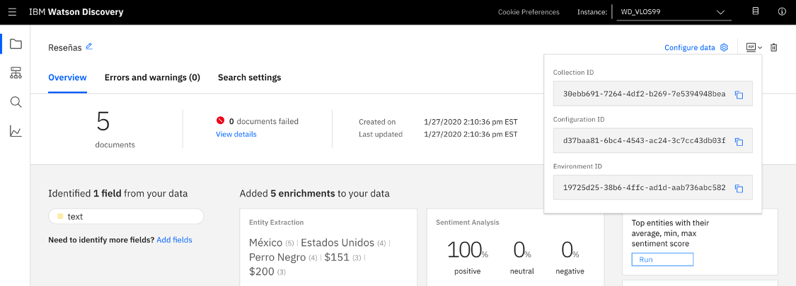

  **Nota importante: Para obtener el apikey de Discovery y la URL, accedemos a la página del servicio de discovery antes de lanzar la herramienta.**
  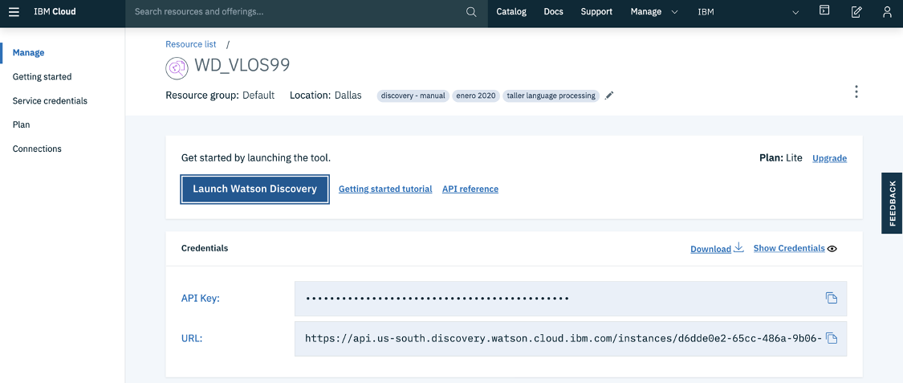

9. Accedemos a la carpeta de nuestro repositorio clonado “watson-discovery-ui” y accedemos al archivo “env.sample” y compiamos todo el contenido de texto.
10. Abrimos un nuevo documento de texto pegamos lo que compiamos del archivo anterior y modificamos las credenciales, agregando las que copiamos de nuestra colección de datos.
11. Una vez que modificamos las credenciales pertinentes, guardamos el archivo como ".env" sin ningún caracter adicional, solo ".env" en la misma carpeta donde se encuentra el archivo "env.sample"
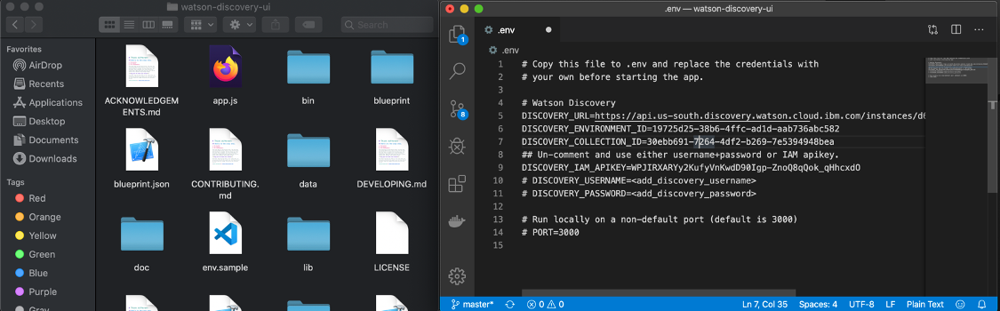
12. Para el siguiente paso es necesario tener instalado **NODE.JS** o **NPM** del **CLI de IBM Cloud**, si no lo has hecho, al principio de este manual, se encuentran los enlaces necesarios.
13. Ahora vamos a desplegar la aplicación utilizando el comando "npm install" seguido de "npm start", claro que esto debe hacerse desde la carpeta de nuestro repositorio.
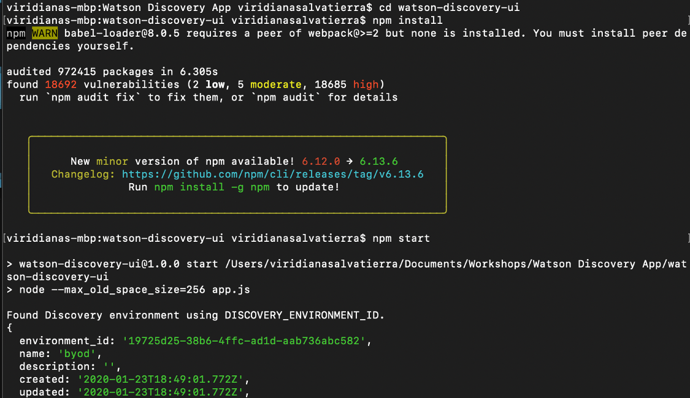
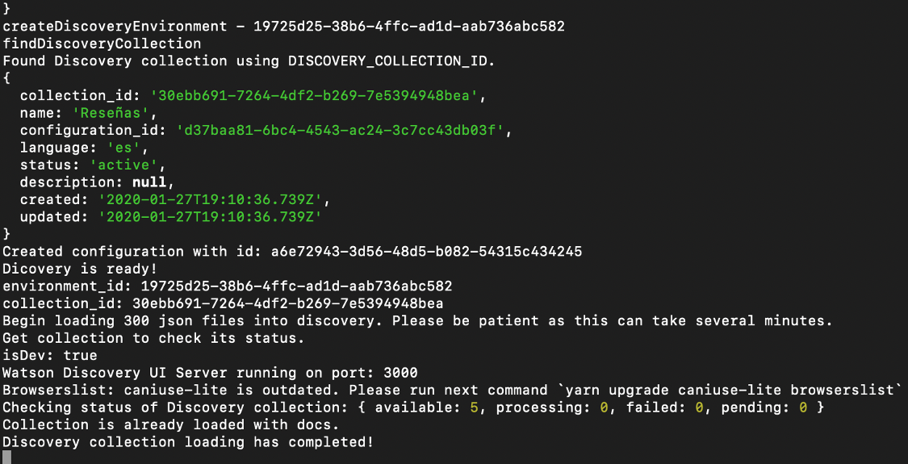
14. Una vez hecho esto, en el navegador, introducimos “localhost:3000” en la barra de direcciones y damos “enter” para desplegar la aplicación en el navegador.
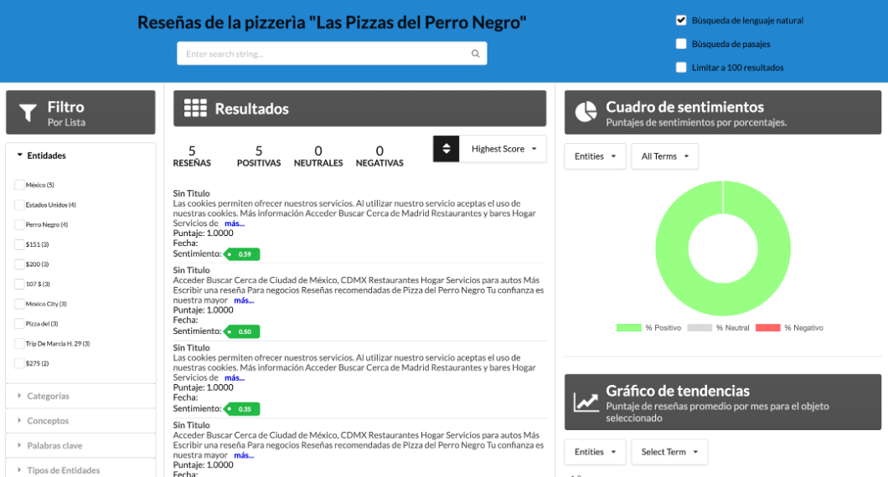
Podemos darnos cuenta de que algunos conceptos aún se manejan en el idioma inglés. Esto es porque son etiquetas dinámicas que se generan desde el servicio de Discovery.

[img-ibmcloud-powered]: https://img.shields.io/badge/IBM%20Cloud-Powered-blue.svg
[url-ibmcloud]: https://www.ibm.com/cloud/
[url-IBMCLOUD]: https://cloud.ibm.com/registration
[url-CLI-IBMCLOUD]: https://cloud.ibm.com/docs/cli/reference/ibmcloud?topic=cloud-cli-install-ibmcloud-cli
[url-github-join]: https://github.com/join
[url-github-cli]: https://git-scm.com/book/en/v2/Getting-Started-Installing-Git
[url-githubdesktop]: https://desktop.github.com/
[url-node]: https://nodejs.org/es/download/
[img-discovery]: https://img.shields.io/badge/IBM%20Cloud-Watson%20Discovery-blue.svg
[url-discovery]: https://www.ibm.com/cloud/watson-discovery
[img-demodis]: https://img.shields.io/badge/DEMO-Watson%20Discovery-red.svg
[url-demodis]: https://discovery-news-demo.ng.bluemix.net/
[url-repodis]: https://github.com/ibmdevelopermx/watson-discovery
